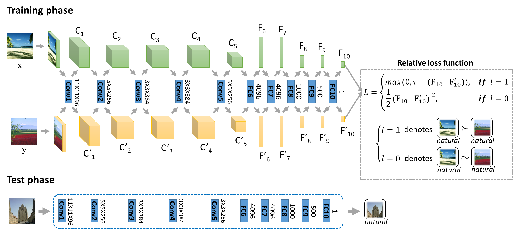
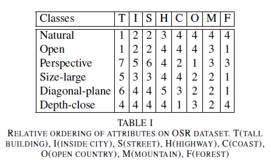
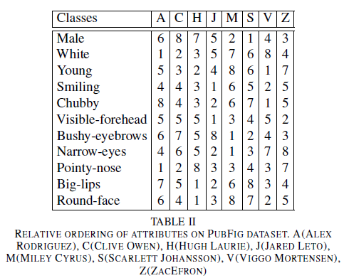

# DRA
Code for the paper deep relative attributes (http://yangxs.ac.cn/publications/DRA.pdf)

The code has been tested on 64bit ubuntu 12.04. The GPU is Titan Black Z with CUDA 7.0.

###1. Make revised caffe_20160725:

sudo make all [-j8]

###2. Download the pretrained caffe model and place it to the Model directory:

http://dl.caffe.berkeleyvision.org/bvlc_reference_caffenet.caffemodel

###3. Download the image dataset and revise the dataset directory in the run_ReNet.m

https://filebox.ece.vt.edu/~parikh/relative_attributes/relative_attributes_v2.zip

The attribute annotations of the OSR and Pubfig datasets are:

 

###4. Run run_ReNet.m

The prospective average result on osr: 0.97 and on pubfig: 0.90.

Note that the performance can be improved by increasing n_tr_pairs.

Please cite the following paper if it helps your research:

    @article{DBLP:journals/tmm/YangZXYHG16,
      author    = {Xiaoshan Yang and Tianzhu Zhang and Changsheng Xu and Shuicheng Yan and M. Shamim Hossain and Ahmed Ghoneim},
      title     = {Deep Relative Attributes},
      journal   = {{IEEE} Trans. Multimedia},
      volume    = {18},
      number    = {9},
      pages     = {1832--1842},
      year      = {2016},
    }
